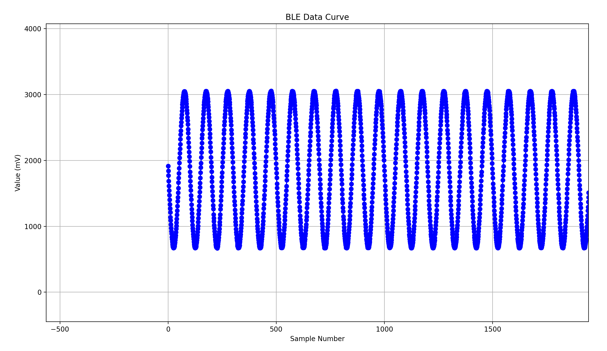

# DA14531-StimulationFeedback
Returns the ADC sampling value via DA14531 BLE. 



本仓库用于测试处理DA14531通过BLE传回ADC的采样值。notification.py用于监听DA14531的Notify，监听结果会储存在同目录下的ble_data.txt中。draw.py用于将ble_data.txt中的采样点绘制成波形图，以及分析其频谱结果。

DAC_Test为使用ESP32生成被采样的正弦波的测试工程。

# About Data Format
DA14531中设置一次传回的数据为20个字节，每两个字节为一个采样值，总共十个采样值。每个采样值内字节倒序计算，例如5b 02表示2\*16\*16+5\*16+11=603mV。

# Requirements
```
pip install bleak
pip install numpy
pip install matplotlib
```